Setting up a Shelly Gen 3 Smart Dimming Controller
==================================================

This page documents getting a Shelly Gen 3 Smart Dimming Controller set up and working with a cheap lamp fitting. The intention was to demonstrate things worked before I started taking apart any wall switches.

The wiring was simple. The Shelly app experience was diabolical and not for the faint-hearted. I've been through this process twice, once with a friend (both of us with computer science degrees) and once alone. Having been through the process once didn't make the experience any better - it seems normal that devices fail to set up or need to be deleted and re-added once set up or need to be factory reset once or twice before things work properly. And the design of the app itself is awful, in general you need to click through various tabs with obscure icons to find what you need. And the Shelly documentation is awful,  working out anything involved a lot of back and forward with ChatGPT and Gemini - Shelly seem to have completely reworked the app at least once which means most information on the web is completely stale and no longer helpful.

With that said, let's get started...

The parts
---------

* A Shelly Gen 3 Smart Dimming Controller.
* A cheap light fitting (usually used to turn a wine bottle into a lamp).
* A dimmable LED light bulb (many LED light bulbs are not dimmable).
* A three pin plug.
* A WAGO 221-413 splicing connector (a fancy way to connect three wires together safely).

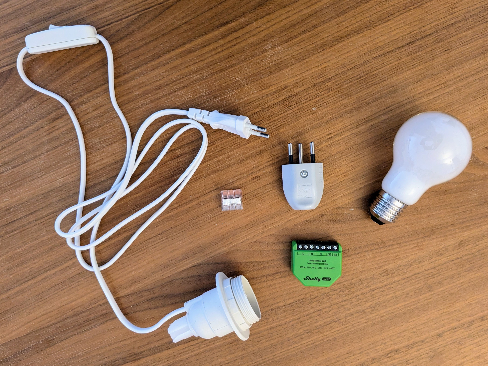

Tools
-----

* Wire cutter.
* Wire stripper.
* Large and small Philips screwdriver.
* Electrical tape and scissors.
* Multimeter.

The electrical tape and multimeter are overkill. I just used the multimeter for connectivity testing. And as we'll see later, there's no situation where tape is really required.

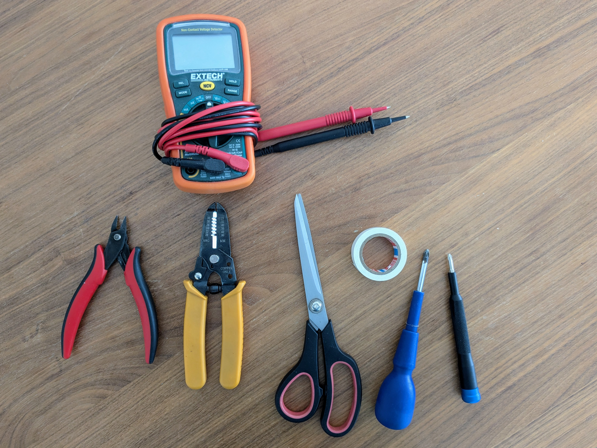

Initial test
------------

Just test that the light fitting works as expected and the switch turns the light on and off.

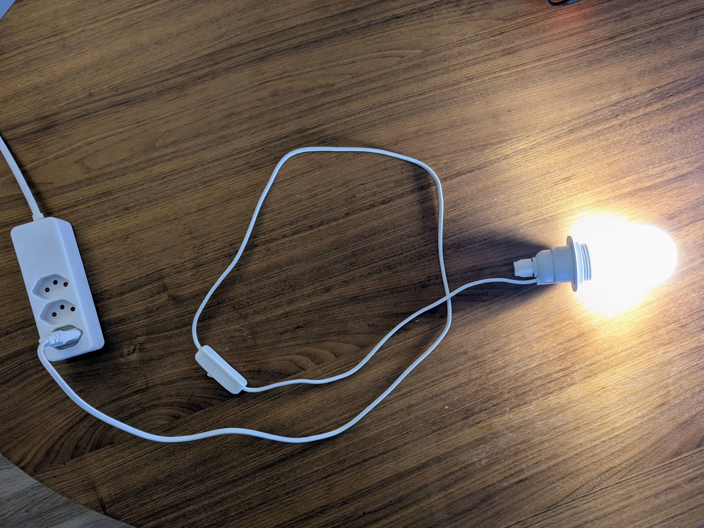

Replace the plug
----------------

The plug that came with the fitting was two pin - so live and neutral can be swapped depending on which way up the plug is plugged into a socket. For a dumb device like a classic light bulb this doesn't matter. But for our setup, it's very important that live is definitely live (and ditto for neutral). So replace the plug with a three pin plug - there's only one way up such a plug can be plugged in, so live and neutral are never swapped. The ground pin on the plug is left unconnected.

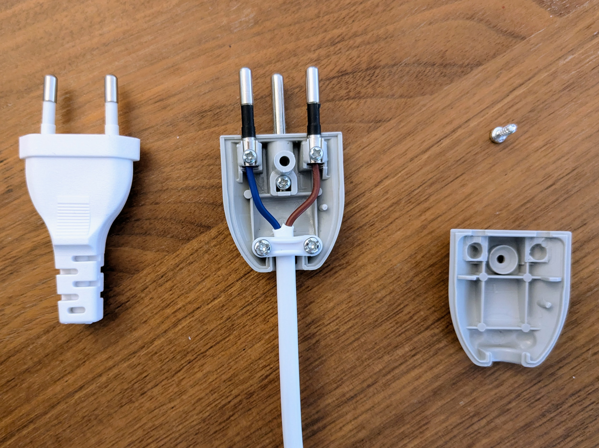

Swiss plug wiring
-----------------

In Switzerland, the pins are as shown here:

| Swiss socket                            | Swiss plug                                                 |
|-----------------------------------------|------------------------------------------------------------|
| 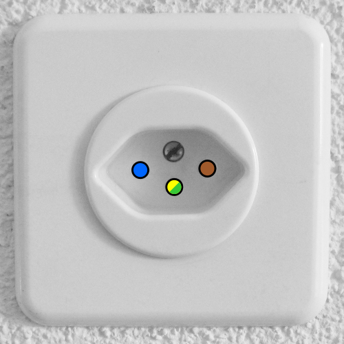     | 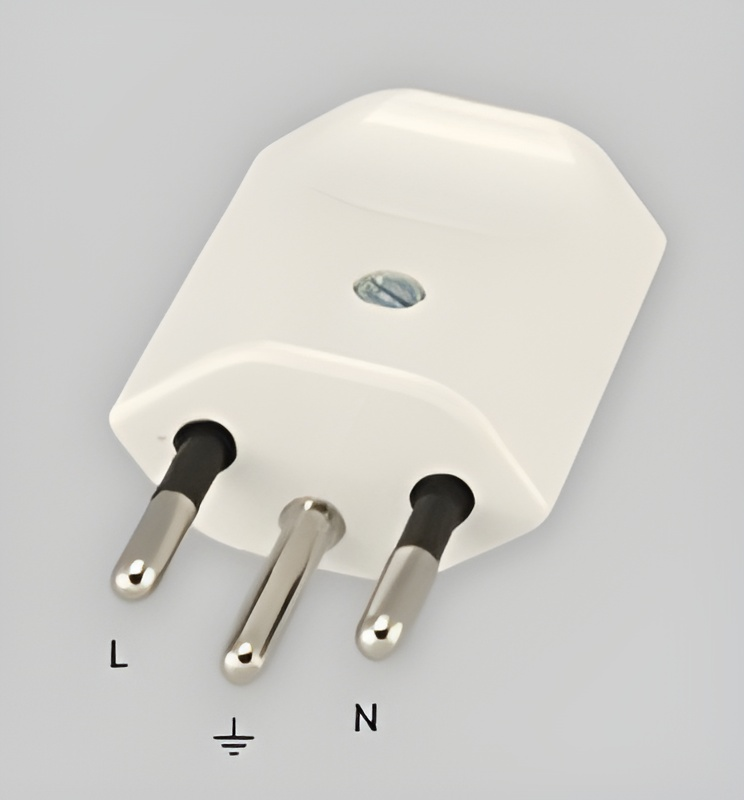 |

Color coding:

* Live - brown.
* Neutral - blue.
* Earth - yellow and green.

Photo credits: [Swiss socket - Wikimedia](https://commons.wikimedia.org/wiki/File:Socket_SN_441011_T13_Polarization.svg) and [Swiss plug - Digital Museum of Plugs and Sockets](https://www.plugsocketmuseum.nl/Swiss1.html).

Second test
-----------

Test that things still work after replacing the plug.

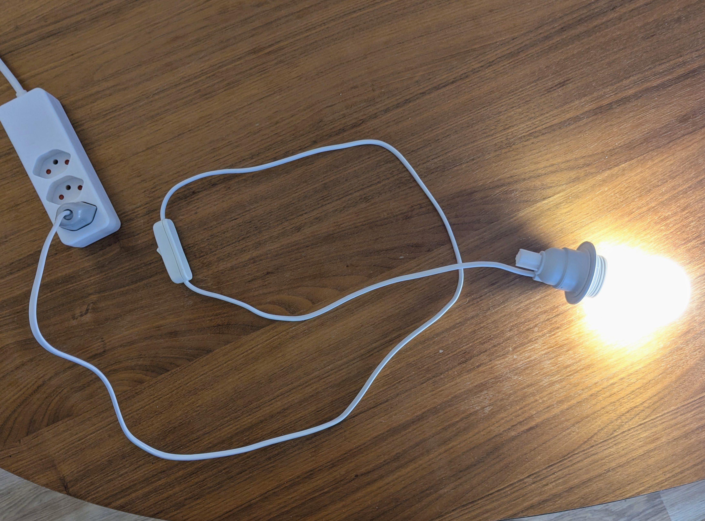

Chop into pieces
----------------

**Warning:** never cut things up or adjust connections while anything is plugged into the mains.

I chopped the light fitting into three parts:

* The light fitting.
* The switch.
* The plug.

I also cut off a short section of the cable and removed a length of blue (neutral) wire that will also be needed.

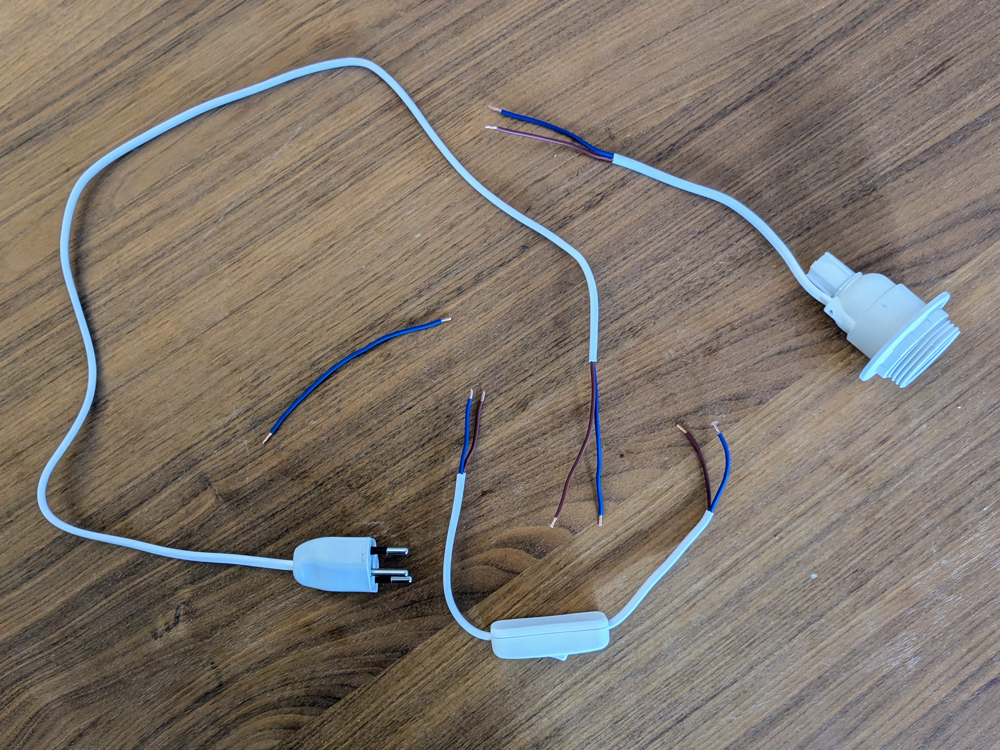

Prepare the switch
------------------

**Note:** I tested the blue and brown wires with the continuity mode on my multimeter. To my surprise the switch only breaks the circuit for the brown wire. As brown is live, this is technically the right thing to do - if brown is always guaranteed to be the live wire. But as discussed earlier, when used with a two pin plug, either wire may be live depending on how the plug was plugged in. So if the plug is plugged in such that the blue wire is live, the light socket will still be connected to live even when switched off. If you're then stupid enough to unscrew the bulb and stick your finger in the light socket while its off but still plugged in, you'll be electrocuted. This sounds like a serious safety issue (and ChatGPT agrees with me). However, this isn't an issue for us - we've guaranteed the polarization by switching to a three pin plug.

We don't need the brown wires of the switch so snip them off. I wrapped things with electrical tape to ensure the slightly exposed blue wire ends couldn't short against anything but this is completely overkill as they're not carrying any current and there's nothing really for them to short against.

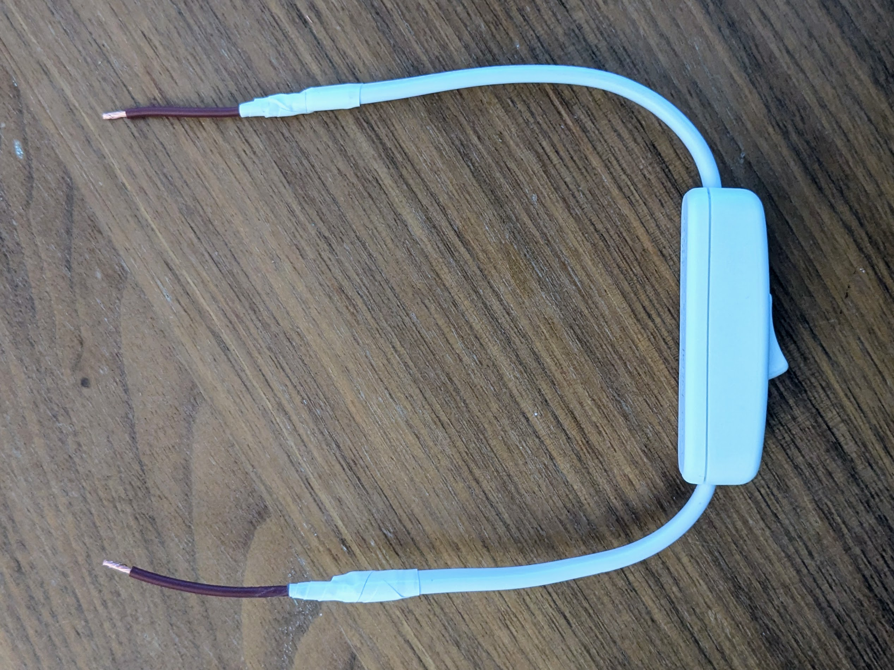

Wire things up
--------------

Using the WAGO connector, connect:

* The neutral wire of the plug.
* The neutral wire of the light fitting.
* The short piece of blue wire.

Then wire things to the Smart Dimmer Controller:

* The live wire of the plug goes to either of the two **L** terminals.
* The live wire of the light fitting goes to either of the two **O** terminals.
* The short piece of blue wire goes to the **N** terminal.

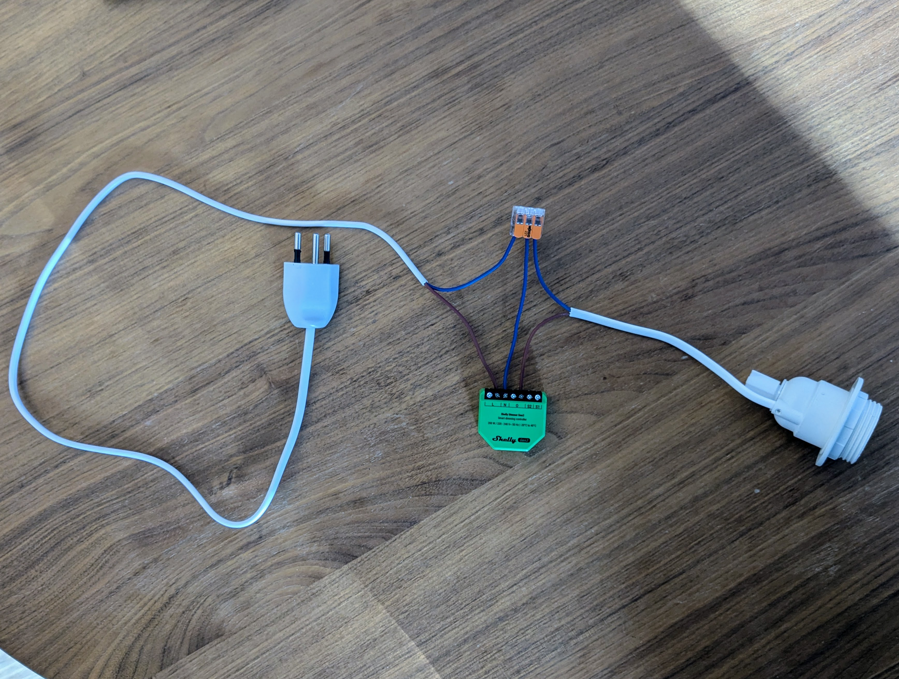

**Close up of wiring:**

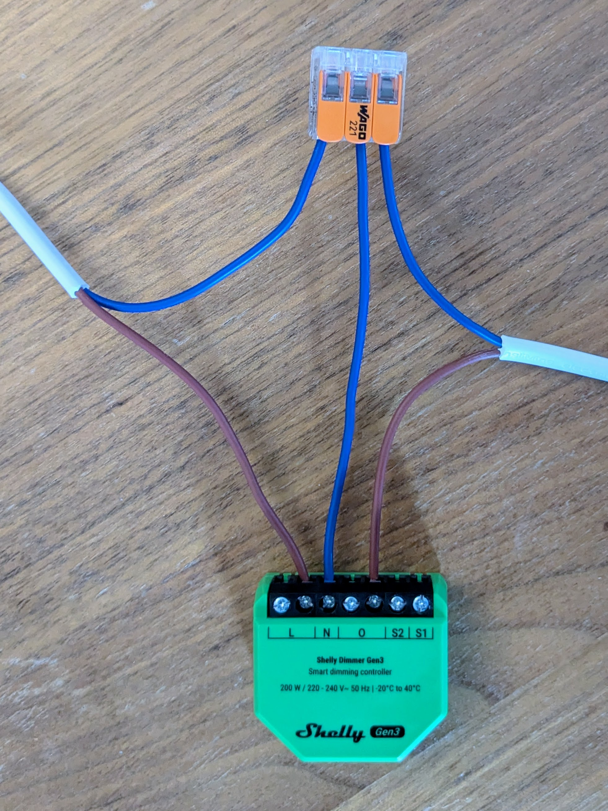

Connect the switch
------------------

As the last step connect the switch to the remaining **L** terminal and to **S1**.

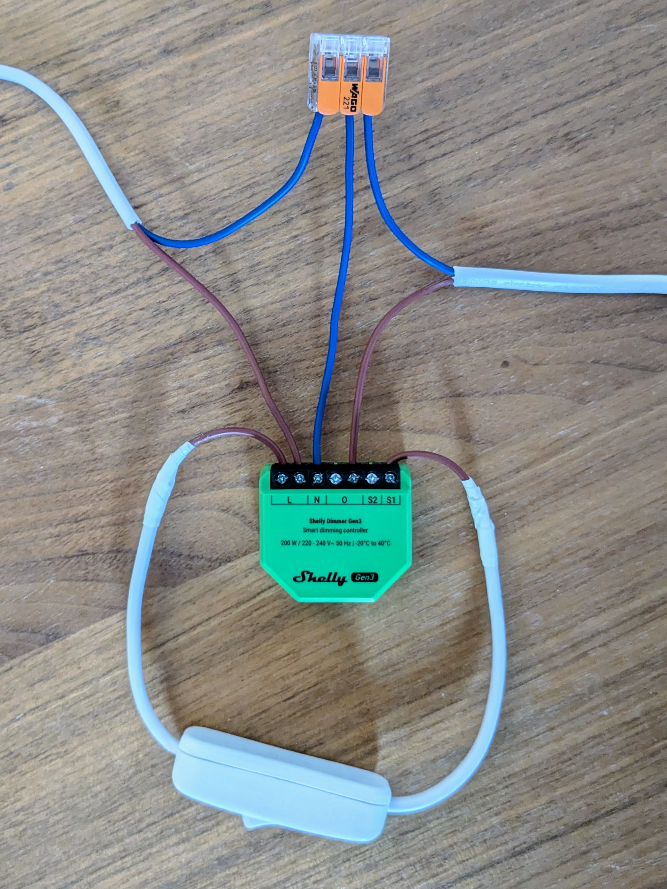

Once everything is properly wired up, plug it back into the mains.

Getting things working
----------------------

I assumed the default for the Smart Dimmer Controller would be for the switch to still be able to turn things on and off even if the Controller wasn't set up. This wasn't the case - flipping the switch did nothing.

So get the [Shelly app](https://www.shelly.com/pages/shelly-app).

This is where things really started to get painful - the app is awful. Once you've registered an account and logged in, add a new device:

<!--suppress HtmlRequiredAltAttribute, CheckImageSize -->
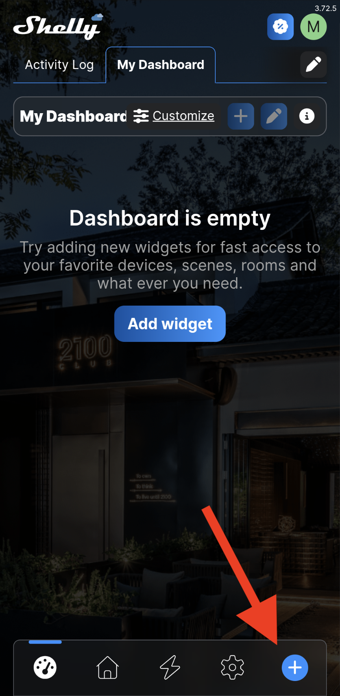

Once it's added, you should be able to turn the light on and off via the app (but the physical switch still won't work):

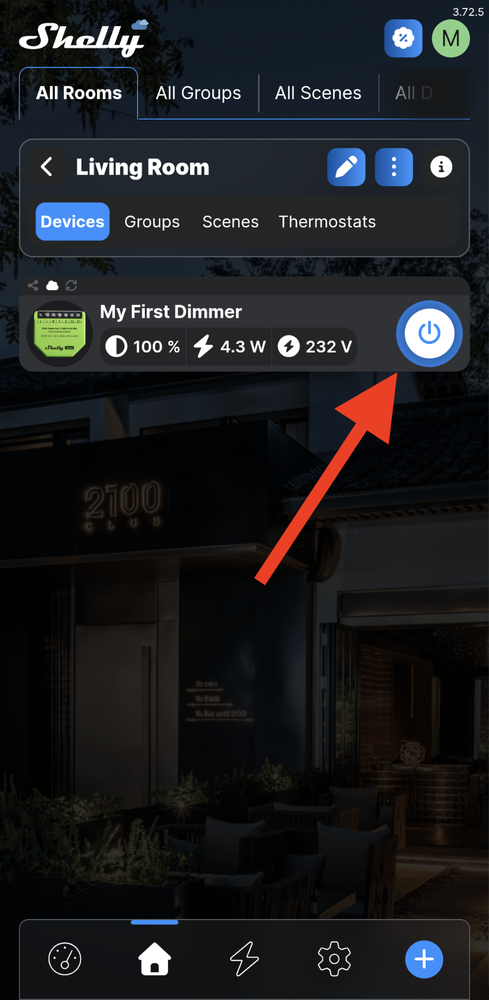

If you click on the device, you can adjust the brightness - though this may not work very well until the device is calibrated (which we'll do later):

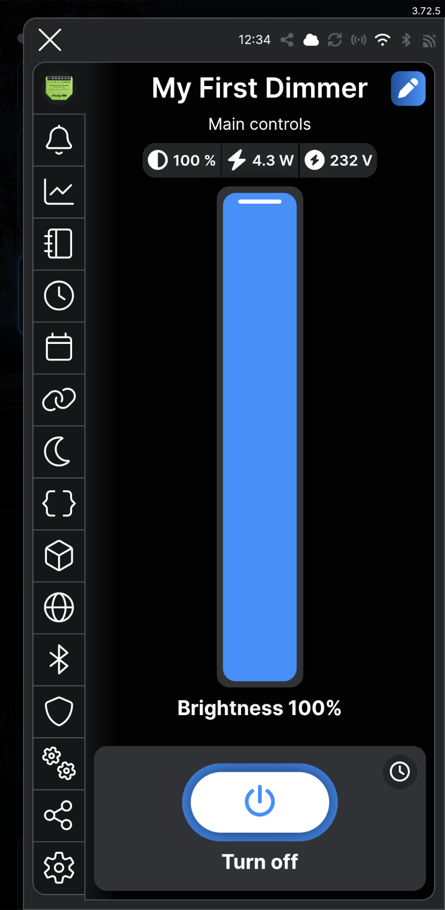

Note that in the screenshot above, you can see the voltage (232V) and the power consumer (4.3W). It's able to determine these values as we connected the Controller's **N** terminal to the real electrical neutral rather than using a [Shelly Bypass](https://www.shelly.com/products/shelly-bypass). Calibration and dimming will also work better as provides the device with a real reference voltage.

Now, go to the device's settings and update the firmware before going further. Despite ordering directly from Shelly, my device came with firmware that was over a year old.

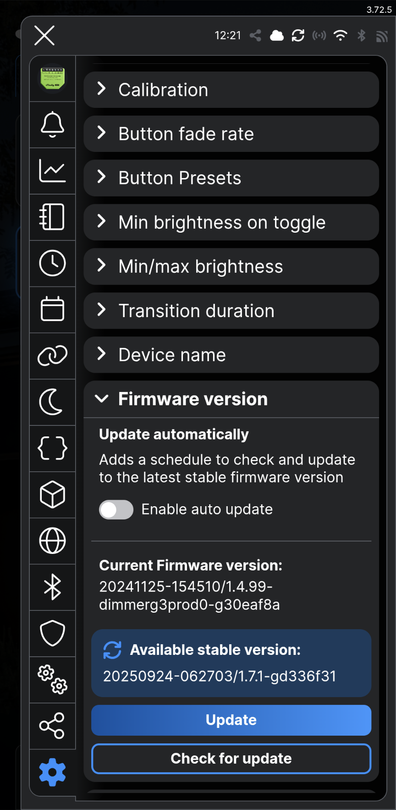

Once it's updated, rebooted and reconnected, go to settings again and change the mode to switch and the output type so it "changes state on every hit". This is the kind of unclear language that pervades the app.

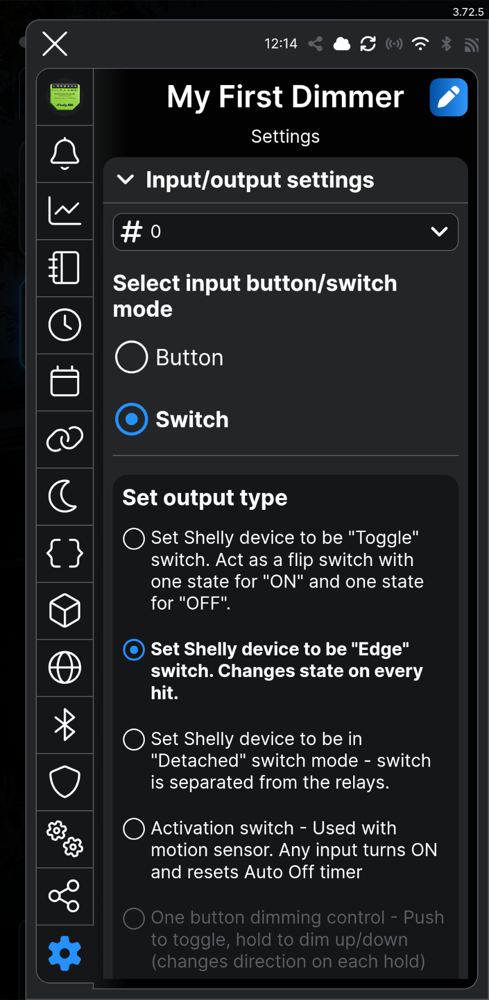

In order to dim properly, the dimmer has to be calibrated.

Now, things should finally work. The bulb can be turned on and off via the app or by using the switch:

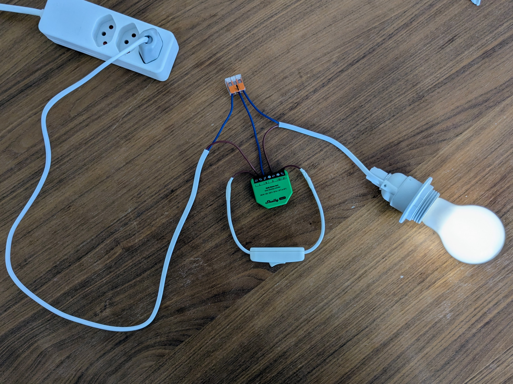

LED bulbs contain a whole load of small LEDs and handle dimming by switching some of them off. The better the bulb the more fine-grained this control. My bulb was the cheapest I could find - at about 10% brightness, it started to flicker and above 50% brightness it didn't get any brighter. There is a setting to control minimum and maximum brightness so one could, e.g. set minimum to be just above the value that any flickering occurs and the maximum to be 50% if that's effectively already the maximum brightness.

Switching the light off has a disconcerting delay where nothing seems to happen initially and then the light fades off. To disable this behavior, change the transition duration from the default 3 seconds to 0:

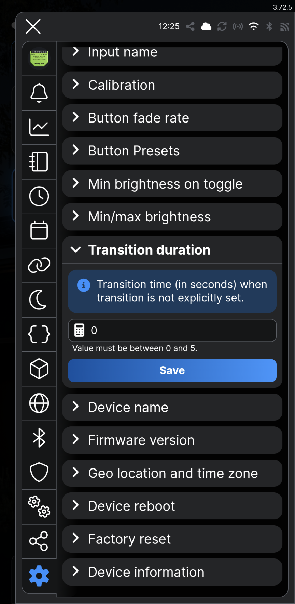

The info bubble about is another bit of useless information - it's telling you that if you were using an API call, the value set here would be used if you didn't specify a duration. We're not using API calls and the value set here is the one that will be used if we turn the light off using the app or the switch.

Adding a Bluetooth switch
-------------------------

I was also interested in turning the light on and off remotely without having to use the app and bought a [Shelly BLU Button Touch 1](https://www.shelly.com/products/shelly-blu-button-tough-1-mocha).

I nearly gave up on this step, getting the button to work was maddening and all information on the web seemed completely out of date.

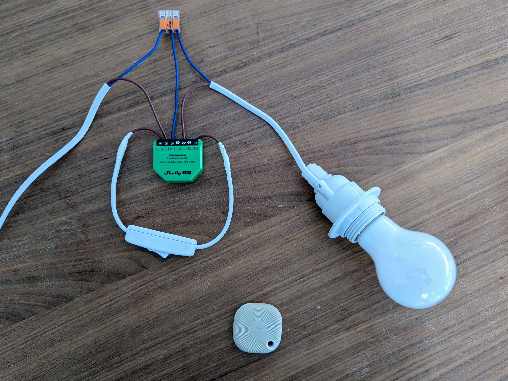

The following are the main steps...

Go to the Bluetooth tab of the Controller and tick enable:

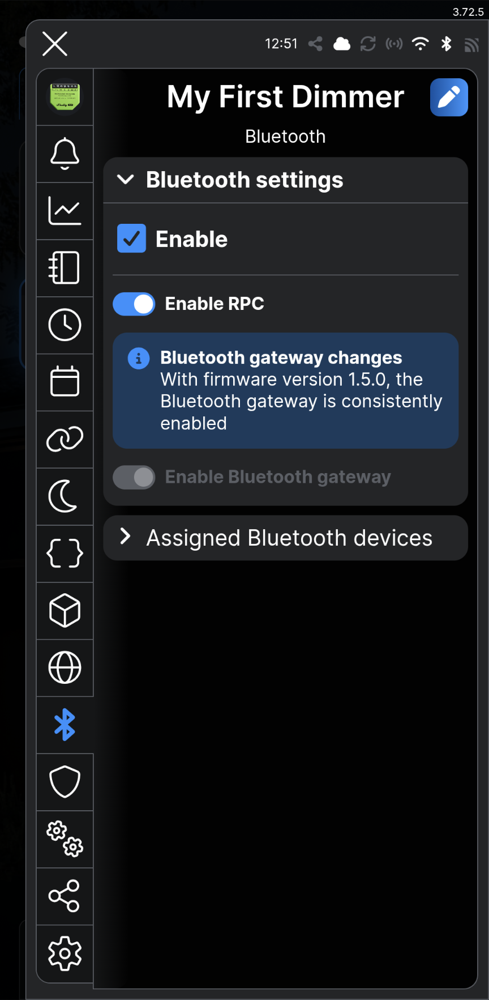

Click the button and hold it for at least 10 seconds, then release - this will put into pairing mode. Then go back to the apps main screen and click the _Add Device_ button and if you're lucky it may immediately detect the device otherwise select the _Add Bluetooth Device_ option. The Smart Dimming Controller actually acts as a gateway between the button and the app.

Once the button is added, update its firmware too:

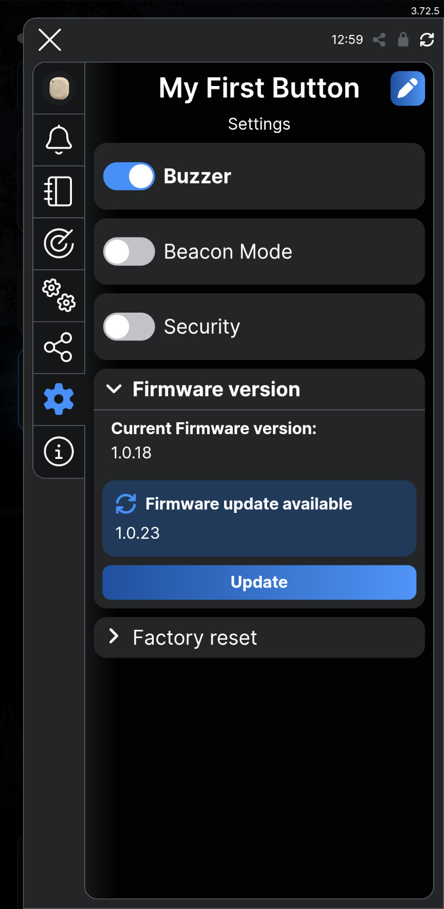

Note that on tabs like settings, you often first have to give the button a short click to wake it up so the app can talk to it.

Once, the button is added, you'll see both your devices in the app:

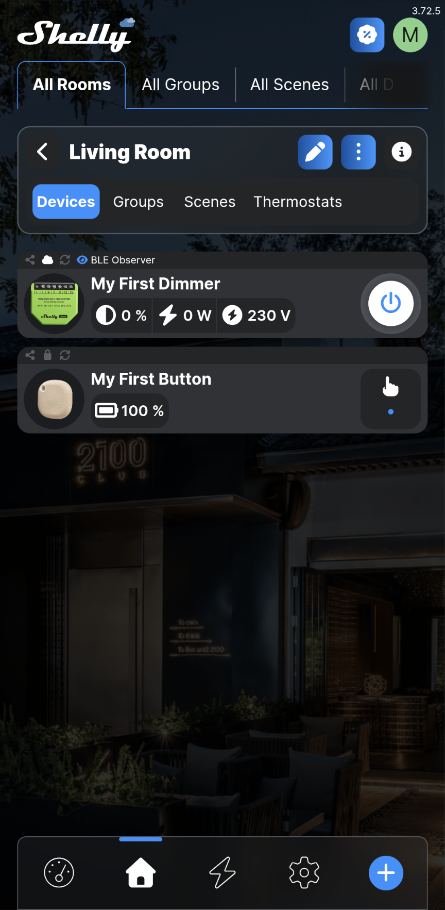

But there's no obvious way to get one to control the other and this is where things got really maddening. There seem to have been several different ways to do this over time, most of which no longer apply. In the end, I got it working by creating a scene, an operation that feels way too involved for something that feels like it shouldn't involve anything more than associating a button with a dimmer.

So go to _All Scenes_:

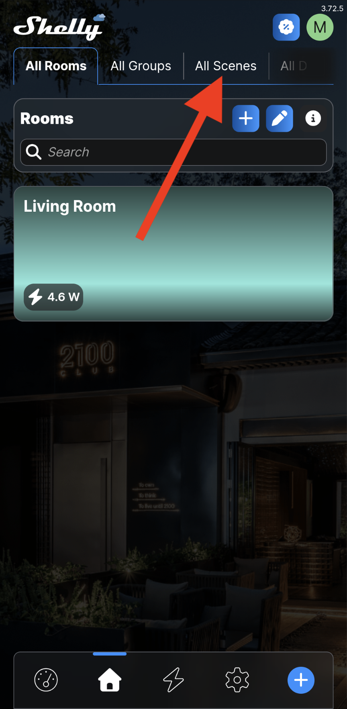

And add a scene, such that you end up with this:

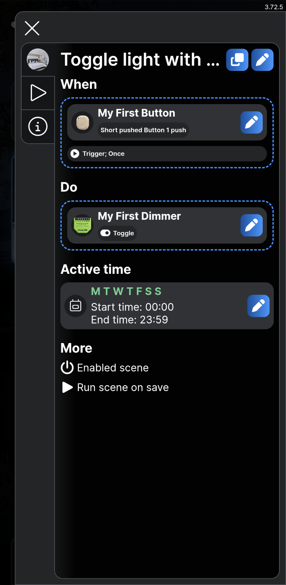

This scene just toggles the light on and off, it seems you'd have to create additional scenes if e.g. you wanted long press to dim or undim the light.

Initially, I could "run" the scene from the app, and it did what I expected (turned the light on and off) but pressing the button didn't trigger the scene. For no obvious reason, I had to completely delete the button and scene from the app and re-add them before things worked correctly - this was typical of the whole app experience.